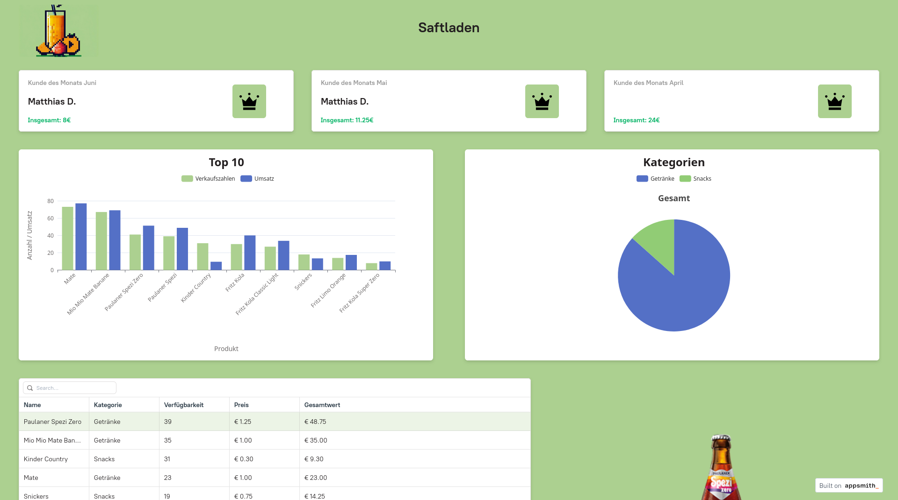

# Kiosk Data Frontend

The [kiosk](https://github.com/morzan1001/Kiosk) is an application for managing a vending machine. Of course, this generates data. For example, which user has made the most purchases or which products are the most popular. The [appsmith](https://github.com/appsmithorg/appsmith) dashboard from this repository can be used to display this data.



## Install

To use the dashboard with Appsmith, the kiosk must be configured to use a Postgres database (or other database with TCP connection). SQLite is not supported. In my case, I use Appsmith in a Docker container and a Postgres database also in a Docker container in the same Docker network. The following Docker compose file could be used for example. Once Appsmith is running, you can simply import the dashboard from this repo and configure the database connection. 

```yaml
version: "3"

services:
   appsmith:
     image: index.docker.io/appsmith/appsmith-ce
     container_name: appsmith
     ports:
         - "80:80"
         - "443:443"
     volumes:
         - ./stacks:/appsmith-stacks
     restart: unless-stopped
     networks:
       - kiosk
     deploy:
       resources:
         limits:
           cpus: '2.5'
           memory: 1.5g
         reservations:
           cpus: '1.25'
           memory: 750m

networks:
  kiosk:
    external: true

```

A small note in passing :warning:. I use the entire kiosk on a Pi 5 with 4GB ram. The CPU performance of the Pi is not a problem, but the 4GB ram is. Appsmith is very hungry, so I have limited the resources of the container to 1.5GB. otherwise the kiosk application can become really unusable. 
